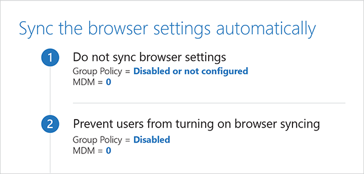
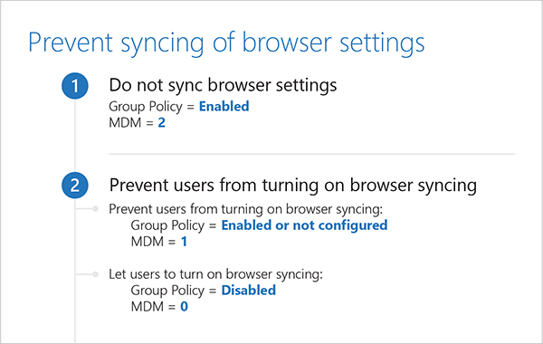

# Sync browser settings  

By default, the “browser” group syncs automatically between the user’s devices, letting users make changes. The “browser” group uses the Sync your Settings option in Settings to sync information like history and favorites. You can configure Microsoft Edge to prevent the “browser” group from syncing and prevent users from turning on the _Sync your Settings_ toggle in Settings. If you want syncing turned off by default but not disabled, select the _Allow users to turn “browser” syncing_ option in the Do not sync browser policy. 

## Relevant policies
- [Do not sync browser settings](#do-not-sync-browser-settings)
- [Prevent users from turning on browser syncing](#prevent-users-from-turning-on-browser-syncing)

You can find the Microsoft Edge Group Policy settings in the following location of the Group Policy Editor unless otherwise noted in the policy:

&nbsp;&nbsp;&nbsp;&nbsp;&nbsp;&nbsp;**Computer Configuration\\Administrative Templates\\Windows Components\\Microsoft Edge\\**

## Configuration options

### Verify the configuration
To verify the settings:
1. In the upper-right corner of Microsoft Edge, click **More** \(**...**\).
2. Click **Settings**.
3. Under Account, see if the setting is toggled on or off.

## Do not sync browser settings
[!INCLUDE [do-not-sync-browser-settings-include](../includes/do-not-sync-browser-settings-include.md)]

## Prevent users from turning on browser syncing
[!INCLUDE [prevent-users-to-turn-on-browser-syncing-include](../includes/prevent-users-to-turn-on-browser-syncing-include.md)]
