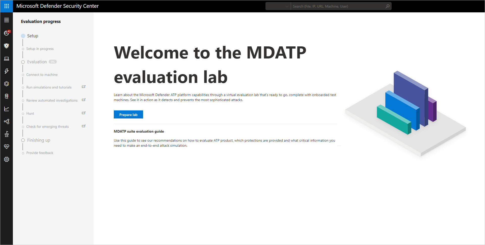
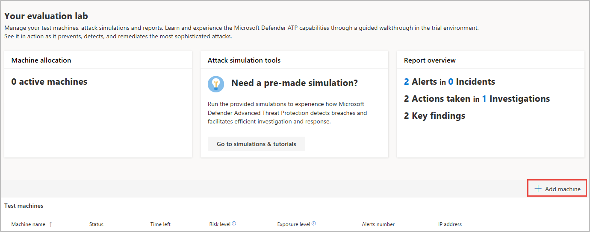
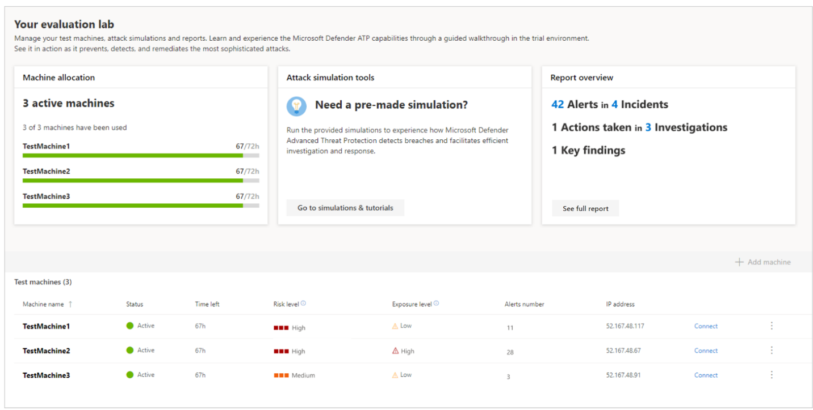
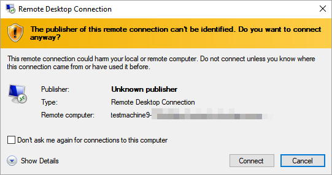
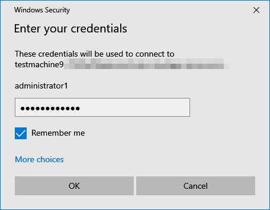
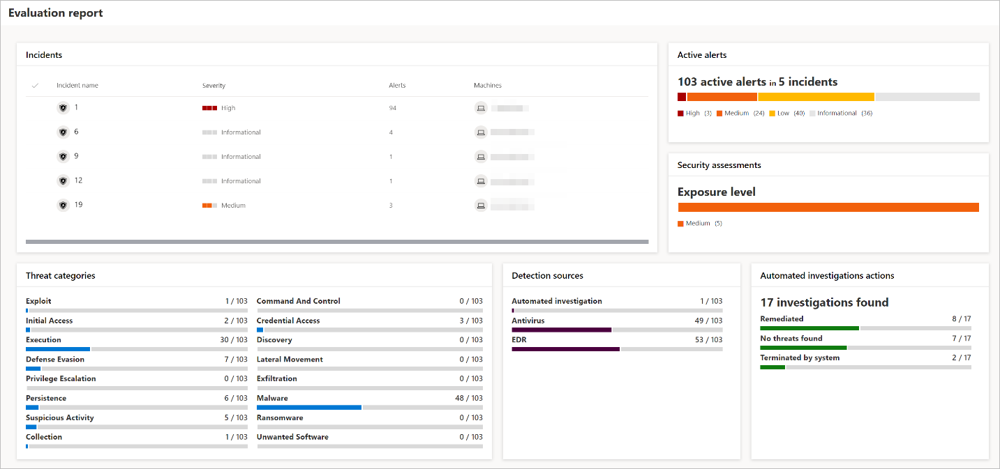
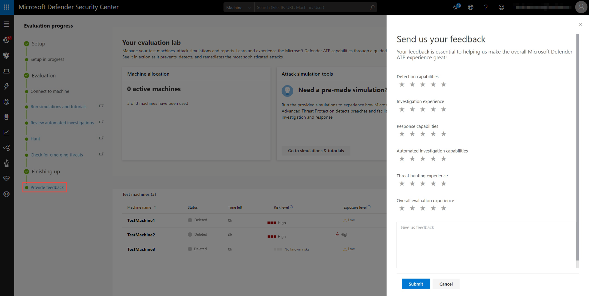

# Microsoft Defender ATP evaluation lab
**Applies to:**
- [Microsoft Defender Advanced Threat Protection (Windows Defender ATP)](https://go.microsoft.com/fwlink/p/?linkid=2069559)

[!include[Prerelease information](prerelease.md)]

Conducting a comprehensive security product evaluation can be a complex process requiring cumbersome environment and machine configuration before an end-to-end attack simulation can actually be done. Adding to the complexity is the challenge of tracking where the simulation activities, alerts, and results are reflected during the evaluation.

The Microsoft Defender ATP evaluation lab is designed to eliminate the complexities of machine and environment configuration so that you can
 focus on evaluating the capabilities of the platform, running simulations, and seeing the prevention, detection, and remediation features in action.

When you get started with the lab, you'll be guided through a simple set-up process where your tenant will be provisioned with test machines. These test machines will come pre-configured to have the latest and greatest Windows 10 version with the right security components in place and Office 2019 Standard installed.

With the simplified set-up experience, you can focus on running your own test scenarios and the pre-made simulations to see how Microsoft Defender ATP performs. 

You'll have full access to all the powerful capabilities of the platform such as automated investigations, advanced hunting, and threat analytics, allowing you to test the comprehensive protection stack that Microsoft Defender ATP offers. 

## Get started with the lab
You can access the lab from the menu. In the navigation menu, select **Evaluation and tutorials > Evaluation lab**.

When you access the evaluation lab for the first time, you'll find an introduction page with a link to the evaluation guide. The guide contains tips and recommendations to keep in mind when evaluating an advanced threat protection product. 

It's a good idea to read the guide before starting the evaluation process so that you can conduct a thorough assessment of the platform.

## Evaluation setup 
When you add a machine to your environment, Microsoft Defender ATP sets up a well-configured machine with connection details. The machine will be configured with the most up to date version of Windows 10 and Office 2019 Standard as well as other apps such as Java, Python, and SysIntenals.

The machine will automatically be onboarded to your tenant with the recommended Windows security components turned on and in audit mode - with no effort on your side. 

  The following security components are pre-configured in the test machines:

- [Attack Surface Reduction](https://docs.microsoft.com/windows/security/threat-protection/windows-defender-exploit-guard/attack-surface-reduction-exploit-guard)
- [Block at first sight](https://docs.microsoft.com/windows/security/threat-protection/windows-defender-antivirus/configure-block-at-first-sight-windows-defender-antivirus)
- [Controlled Folder Access](https://docs.microsoft.com/windows/security/threat-protection/windows-defender-exploit-guard/controlled-folders-exploit-guard)
- [Exploit Protection](https://docs.microsoft.com/windows/security/threat-protection/windows-defender-exploit-guard/enable-exploit-protection)
- [Network Protection](https://docs.microsoft.com/windows/security/threat-protection/windows-defender-exploit-guard/network-protection-exploit-guard)
- [Potentially unwanted application detection](https://docs.microsoft.com/windows/security/threat-protection/windows-defender-antivirus/detect-block-potentially-unwanted-apps-windows-defender-antivirus)
- [Cloud-delivered protection](https://docs.microsoft.com/windows/security/threat-protection/windows-defender-antivirus/utilize-microsoft-cloud-protection-windows-defender-antivirus)
- [Windows Defender SmartScreen](https://docs.microsoft.com/windows/security/threat-protection/windows-defender-smartscreen/windows-defender-smartscreen-overview)

>[!NOTE]
> Windows Defender Antivirus will be on (not in audit). If Windows Defender Antivirus blocks you from running your simulation, you may turn off real-time protection on the machine through Windows Security. For more information, see [Configure always-on protection](https://docs.microsoft.com/windows/security/threat-protection/windows-defender-antivirus/configure-real-time-protection-windows-defender-antivirus).

Automated investigation settings will be dependent on tenant settings. It will be configured to be semi-automated by default. For more information, see [Overview of Automated investigations](automated-investigations.md).

>[!NOTE]
>The connection to the test machines is done using RDP. Make sure that your firewall settings allow RDP connections.

1. In the navigation pane, select **Evaluation and tutorials > Evaluation lab**.

2. Select **Prepare lab**. 

     

3. Select **Add machine**.

    >[!WARNING]
    > The evaluation environment can only be provisioned up to three test machines. Each machine will only be available for three days from the day of activation. 

   

    >[!NOTE]
    >If something goes wrong with the machine creation process, you'll be notified and you'll need to submit a new request. If the machine creation fails, it will not be counted against the overall allowed quota. 

4. The connection details are displayed. Select **Copy** to save the password for the machine.

    >[!NOTE]
    >The password is only displayed once. Be sure to save it for later use.

5. Machine set up begins. This can take up to approximately 30 minutes. 

The environment will reflect your test machine status through the evaluation - including risk score, exposure score, and alerts created through the simulation.

## Simulate attack scenarios
Use the test machines to run attack simulations by connecting to them. 

If you are looking for a pre-made simulation, you can use our ["Do It Yourself" attack scenarios](https://securitycenter.windows.com/tutorials). These scripts are safe, documented, and easy to use. These scenarios will reflect Microsoft Defender ATP capabilities and walk you through investigation experience.

You can also use [Advanced hunting](advanced-hunting.md) to query data and [Threat analytics](threat-analytics.md) to view reports about emerging threats.

>[!NOTE]
>The connection to the test machines is done using RDP. Make sure that your firewall settings allow RDP connections.

1. Connect to your machine and run an attack simulation by selecting **Connect**. 

    

2. Save the RDP file and launch it by selecting **Connect**.

    

    >[!NOTE]
    >If you don't have a copy of the password saved during the initial setup, you can reset the password by selecting **Reset password** from the menu:
    >  
    > The machine will change it’s state to “Executing password reset", then you’ll be presented with your new password in a few minutes.

3. Enter the password that was displayed during the machine creation step. 

   

4. Run simulations on the machine. 

After running your simulations, we encourage you to walk through the lab progress bar and explore Microsoft Defender ATP features. See if your attacks triggered an automated investigation and remediation, check out the evidence collected and analyzed by the feature.

Hunt for attack evidence through Advanced hunting by using the rich query language and raw telemetry and check out some world-wide threats documented in Threat analytics.

## Simulation results
Get a full overview of the simulation results, all in one place, allowing you to drill down to the relevant pages with every detail you need.

View the machine details page by selecting the machine from the table. You'll be able to drill down on relevant alerts and investigations by exploring the rich context provided on the attack simulation. 

### Evaluation report
The lab reports summarize the results of the simulations conducted on the machines. 

At a glance, you'll quickly be able to see:
- Incidents that were triggered
- Generated alerts
- Assessments on exposure level 
- Threat categories observed
- Detection sources
- Automated investigations

## Provide feedback
Your feedback helps us get better in protecting your environment from advanced attacks. Share your experience and impressions from product capabilities and evaluation results.

Let us know what you think, by selecting **Provide feedback**.

