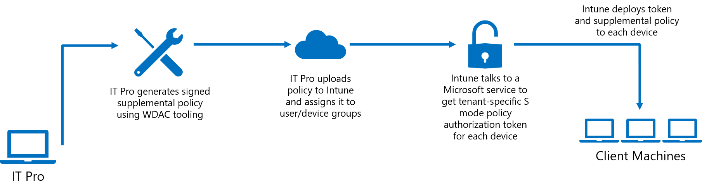

# Allow Enterprise Apps on Intune-Managed S Mode Devices

**Applies to:**

-   Windows 10

Beginning in 19H2, we've partnered with Microsoft Intune to allow Enterprise and Education customers to run business critical Win32 applications on their Intune-managed S mode devices. Enterprise and Education customers have expressed excitement about the security benefits that S mode has to offer, but we've also heard requests for more control over the application control policy running on their managed S mode devices. Some customers need to run critical Line of Business apps which are not in the Microsoft Store, and others need to run some of the Windows components that are normally blocked in S mode, such as PowerShell. 

With Intune, IT Pros can now configure their managed S mode devices using a supplemental policy that expands the S mode base policy to authorize the apps their business uses. This feature moves S mode from “every app is Microsoft-verified" to “every app is verified by Microsoft or your organization”. 

# Policy Authorization Process

The general steps for expanding the S mode base policy on your devices are to generate a supplemental policy, sign that policy, and then upload the signed policy to Intune and assign it to user or device groups.
1. Generate a supplemental policy with WDAC tooling

    This policy will expand the S mode base policy to authorize additional applications. Anything authorized by either the S mode base policy or your supplemental policy will be allowed to run. Your supplemental policies can specify filepath rules, trusted publishers, and more. 

    Refer to [Deploy multiple Windows Defender Application Control Policies](deploy-multiple-windows-defender-application-control-policies.md) for guidance on creating supplemental policies and [Deploy Windows Defender Application Control policy rules and file rules](windows-defender-application-control\select-types-of-rules-to-create.md) for options for fleshing out your policy.

    > [!Note] Policies which are supplementing the S mode base policy must use **-SupplementsBasePolicyID 5951A96A-E0B5-4D3D-8FB8-3E5B61030784**, as this is the S mode policy ID.
2. Sign policy
    To sign your policy, you can choose to use the Device Guard Signing Service or your organization's custom Public Key Infrastructure (PKI). Note that only signed policies are allowed on S mode. Refer to [Use the Device Guard Signing Portal in the Microsoft Store for Business](use-device-guard-signing-portal-in-microsoft-store-for-business.md) for guidance on using DGSS and [Create a code signing cert for WDAC](create-code-signing-cert-for-windows-defender-application-control.md) for guidance on signing using an internal CA.

    Once your policy is signed, you must authorize one or more signers that can be used to update the policy in the future. Use Add-SignerRule to add the signing certificate to the WDAC policy, filling in the correct path and filenames for <policypath> and <certpath>: 
        `Add-SignerRule -FilePath <policypath> -CertificatePath <certpath> -User -Update`
3. Upload signed policy to Intune and assign it to user or device groups
    Intune will talk to the OneCore Device Unlock Service (OCDUS) on the backend to generate tenant- and device- specific authorization tokens. Intune then pushes down the corresponding authorization token and supplemental policy to each device in the assigned group. Together, these expand the S mode base policy on the device. 
    <!-- Intune link?-->

# Standard Process for Deploying Apps through Intune

Refer to [Intune Standalone - Win32 app management](https://docs.microsoft.com/intune/apps-win32-app-management)  for guidance on the existing procedure of packaging signed catalogs and app deployment.

# Optional: Process for Deploying Apps using Catalogs

Your supplemental policy can be used to significantly relax the S mode base policy, but there are security trade-offs you must consider in doing so. For example, you can use a signer rule to trust an external signer, but that may authorize apps you don’t want to allow as well. Similarly, you may have apps that are not signed or only partly signed and you don’t want to allow based on file path given the weaker security value of such a rule. 

Instead, Intune has added new functionality to make it easier to authorize existing applications without requiring repackaging or access to the source code through the use of signed catalogs. This works for apps which may be unsigned or even signed apps when you don’t want to trust all apps that may share the same signing certificate.

The basic process is to generate a catalog file for each app using Package Inspector, then sign the catalog files using the DGSS or a custom PKI. After that, IT Pros can use the standard Intune app deployment process outlined above. Refer to [Deploy catalog files to support Windows Defender Application Control](deploy-catalog-files-to-support-windows-defender-application-control.md) for more in-depth guidance on generating catalogs. 
    > [!Note] Every time an app updates, you will need to deploy an updated catalog. Because of this, IT Pros should try to avoid using catalog files for applications that auto-update and direct users not to update applications on their own.

